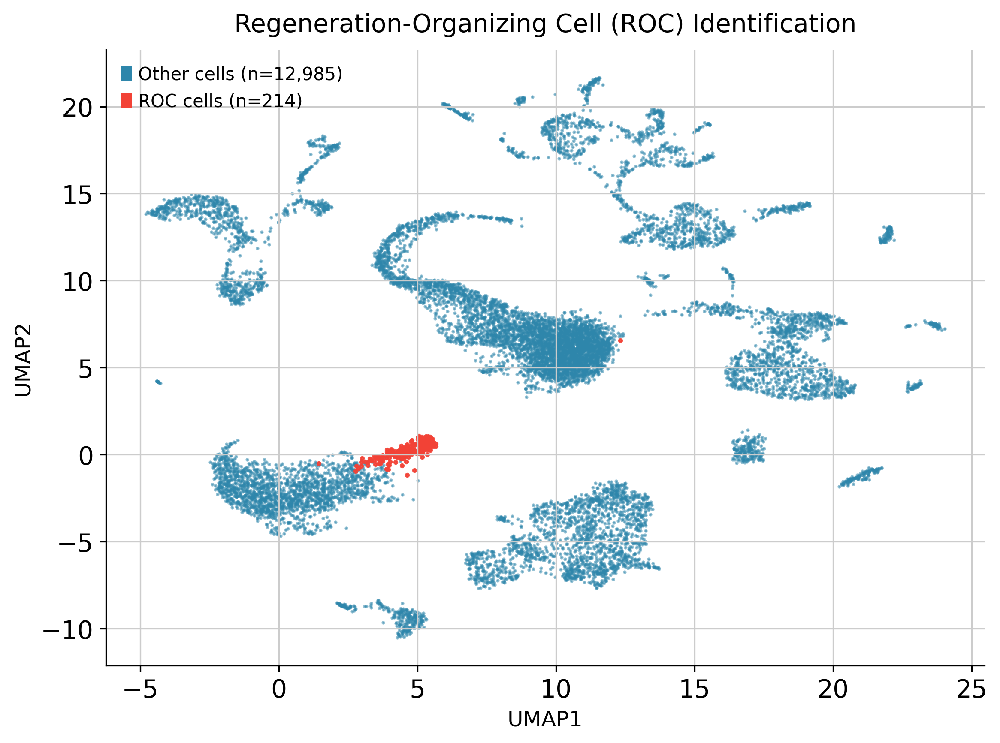
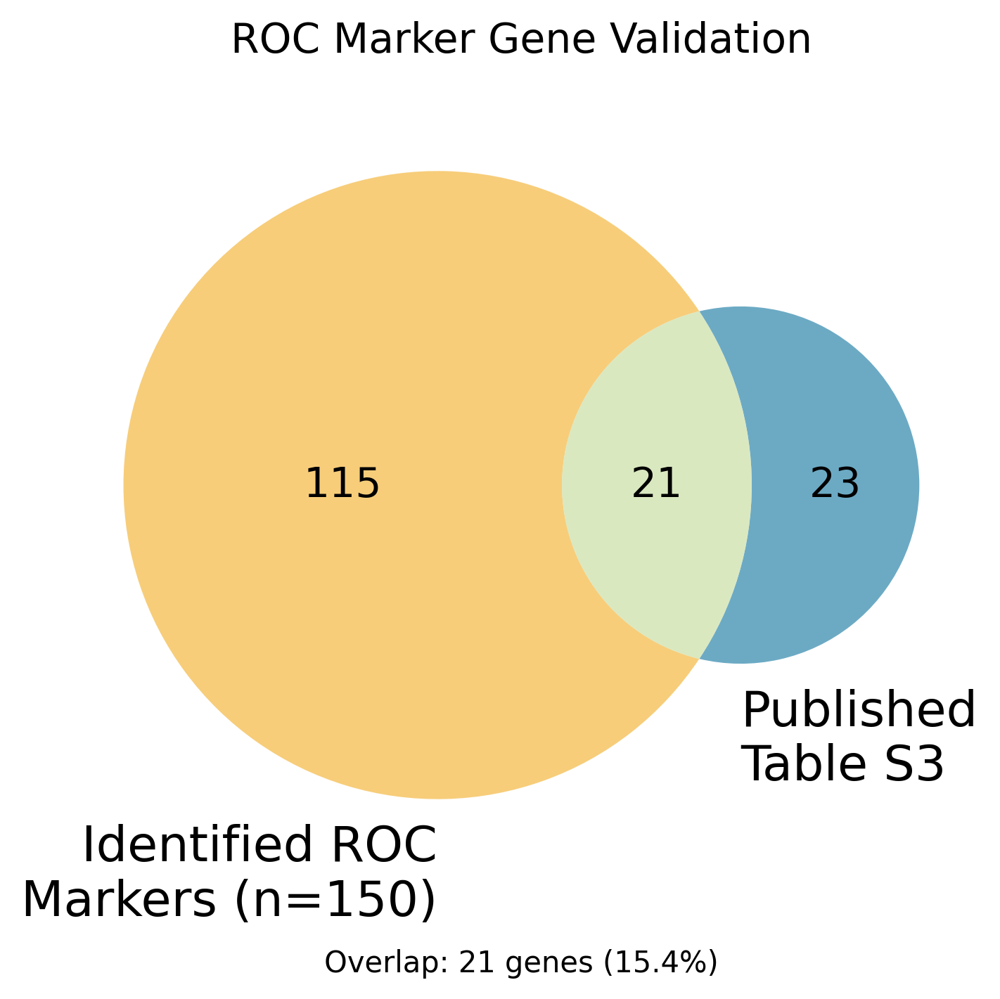
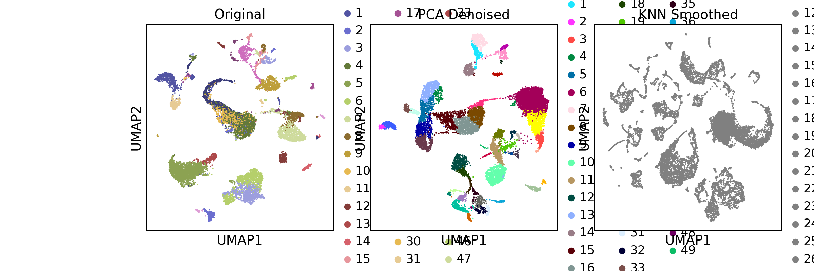
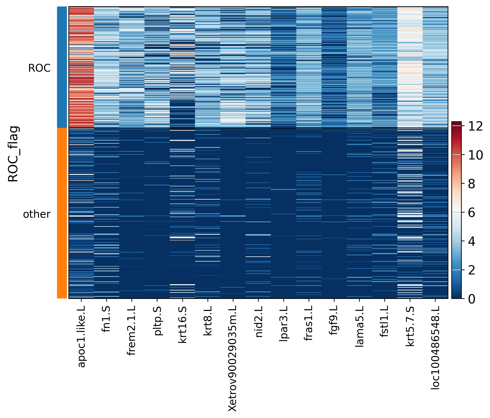

# Comparative Analysis of scRNA-seq Clustering Methods

**Systematic evaluation of clustering algorithms, denoising techniques, and batch integration for single-cell RNA sequencing**

[View Code](https://github.com/db-d2/stat4243_proj1/blob/main/code/ROC_xenopus_colab_final.ipynb) | [Open in Colab](https://colab.research.google.com/github/db-d2/stat4243_proj1/blob/main/code/ROC_xenopus_colab_final.ipynb)

## Abstract

This project systematically compares clustering methods (Walktrap vs Leiden), denoising approaches (PCA reconstruction vs k-NN smoothing), and batch integration techniques (Harmony vs BBKNN) using a 13,199-cell *Xenopus* tail regeneration dataset. The comparative analysis demonstrates substantial agreement between methods (ARI=0.637, Rand=0.944) while achieving an 11-fold improvement in clustering quality through optimization. As a biological validation, the optimized pipeline successfully identifies 214 Regeneration-Organizing Cells (ROCs) with statistical significance (p=7.99×10⁻⁴⁰).

## Key Results

### Methods Comparison
- **Clustering Agreement**: Walktrap vs Leiden show ARI=0.637, Rand=0.944
- **Denoising Impact**: Evaluated across PCA reconstruction and k-NN smoothing
- **Batch Integration**: Compared Harmony and BBKNN approaches
- **Quality Improvement**: 11-fold increase through systematic optimization

### Biological Validation
- **214 ROC cells** identified (1.62% of total)
- **21 genes** overlap with published markers (p=7.99×10⁻⁴⁰)

## Main Figures

### ROC Identification

*UMAP visualization showing 214 computationally identified ROC cells (red) among 13,199 total cells*

### Marker Validation

*Overlap between computational markers and published ROC signatures (p=7.99×10⁻⁴⁰)*

### Method Optimization

*Comparison of clustering quality across denoising methods*

### Gene Expression

*Differential expression of top ROC markers*

## Documentation

[Full Technical Write-up](./Writeup.md) - Complete methods, results, and analysis

## Data Availability

- **Processed dataset**: `cleaned_processed_frogtail.h5ad` (1.2GB)
- **Published markers**: `aav9996_tables3.xlsx` (Aztekin et al. 2019)
- **Analysis notebook**: `ROC_xenopus_colab_final.ipynb`

## Citation

Original data from: Aztekin et al. (2019) Science 364:653

---
